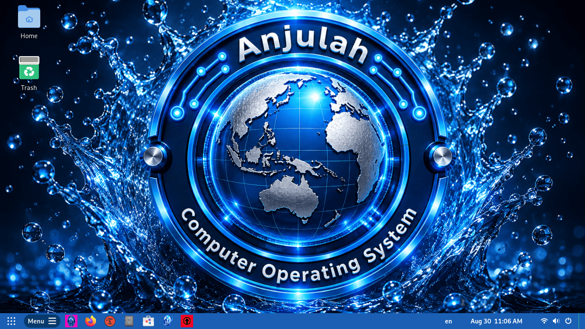

# Anjulah OS

Built on Debian, Anjulah OS is a Linux distribution designed to deliver a simple, user-friendly, and stable GNOME desktop experience.

## Features

- Based on Debian 13 (Trixie)
- GNOME desktop with custom theming (GDM, Plymouth, GNOME Shell)
- ArcMenu and Dash to Panel for modern workflow
- Calamares installer with custom branding
- BIOS Legacy and UEFI boot support
- Wayland and Xorg selectable via GDM
- Pre-installed: Firefox ESR, Timeshift, Déjà Dup

## Download

**[Download Anjulah OS](https://www.anjulah.com/download)**

Verify your download with the SHA-256 checksum and GPG signature files provided on the download page. The [public key](anjulah-os-public-key.asc) is available in this repository.
Fingerprint: BF0064CA257ACEF411505F76C91A509A0D931F03

## System Requirements

- Processor: Dual-core (tested: Intel Core 2 Duo E7600)
- Memory: 4 GB RAM
- Storage: 20 GB
- Boot: BIOS Legacy or UEFI

## Building from Source

- [BUILD-INSTRUCTIONS.md](BUILD-INSTRUCTIONS.md) — deploy customizations to squashfs-root
- [COMPILE-INSTRUCTIONS.md](COMPILE-INSTRUCTIONS.md) — build ISO from squashfs-root

## Repository Structure

This repository contains the source files for Anjulah OS customizations. See [MAPPING.md](MAPPING.md) for the complete file mapping.

## License

Dual-licensed:
- Code, scripts, and configuration files: [GPL-3.0+](https://www.gnu.org/licenses/gpl-3.0.txt)
- Artwork, wallpapers, logos, and avatars: [CC BY-NC-SA 4.0](https://creativecommons.org/licenses/by-nc-sa/4.0/legalcode)

See [LICENSE](LICENSE) for details.

## Links

- Website: [https://www.anjulah.com](https://www.anjulah.com)
- Bug reports: [GitHub Issues](https://github.com/anjulahos/anjulah-os/issues)
